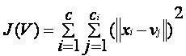
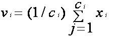

# k-means clustering algorithm
k-means is  one of  the simplest unsupervised  learning  algorithms  that  solve  the well  known clustering problem. The procedure follows a simple and  easy  way  to classify a given data set  through a certain number of  clusters (assume k clusters) fixed apriori. The  main  idea  is to define k centers, one for each cluster. These centers  should  be placed in a cunning  way  because of  different  location  causes different  result. So, the better  choice  is  to place them  as  much as possible  far away from each other. The  next  step is to take each point belonging  to a  given data set and associate it to the nearest center. When no point  is  pending,  the first step is completed and an early group age  is done. At this point we need to re-calculate k new centroids as barycenter of  the clusters resulting from the previous step. After we have these k new centroids, a new binding has to be done  between  the same data set points  and  the nearest new center. A loop has been generated. As a result of  this loop we  may  notice that the k centers change their location step by step until no more changes  are done or  in  other words centers do not move any more. Finally, this  algorithm  aims at  minimizing  an objective function know as squared error function given by: 

###                                                                        

where,
                           ‘||xi - vj||’ is the Euclidean distance between xi and vj.

                           ‘ci’ is the number of data points in ith cluster.

                           ‘c’ is the number of cluster centers.
                           
                           
## Algorithmic steps for k-means clustering

Let  X = {x1,x2,x3,……..,xn} be the set of data points and V = {v1,v2,…….,vc} be the set of centers.

1) Randomly select ‘c’ cluster centers.

2) Calculate the distance between each data point and cluster centers.

3) Assign the data point to the cluster center whose distance from the cluster center is minimum of all the cluster centers..

4) Recalculate the new cluster center using: 

###   

where, ‘ci’ represents the number of data points in ith cluster.

5) Recalculate the distance between each data point and new obtained cluster centers.

6) If no data point was reassigned then stop, otherwise repeat from step 3).

## Advantages

1) Fast, robust and easier to understand.

2) Relatively efficient: O(tknd), where n is # objects, k is # clusters, d is # dimension of each object, and t  is # iterations. Normally, k, t, d << n.

3) Gives best result when data set are distinct or well separated from each other.

## Disadvantages

1) The learning algorithm requires apriori specification of the number of  cluster centers.

2) The use of  Exclusive Assignment - If  there are two highly overlapping data then k-means will not be able to resolve       that there are two clusters.

3) The learning algorithm is not invariant to non-linear transformations i.e. with different representation of data we get

    different results (data represented in form of cartesian co-ordinates and polar co-ordinates will give different results).
4) Euclidean distance measures can unequally weight underlying factors.

5) The learning algorithm provides the local optima of the squared error function. 

6) Randomly choosing of the cluster center cannot lead us to the fruitful result. Pl. refer Fig.

7) Applicable only when mean is defined i.e. fails for categorical data.

8) Unable to handle noisy data and outliers.

9) Algorithm fails for non-linear data set.
